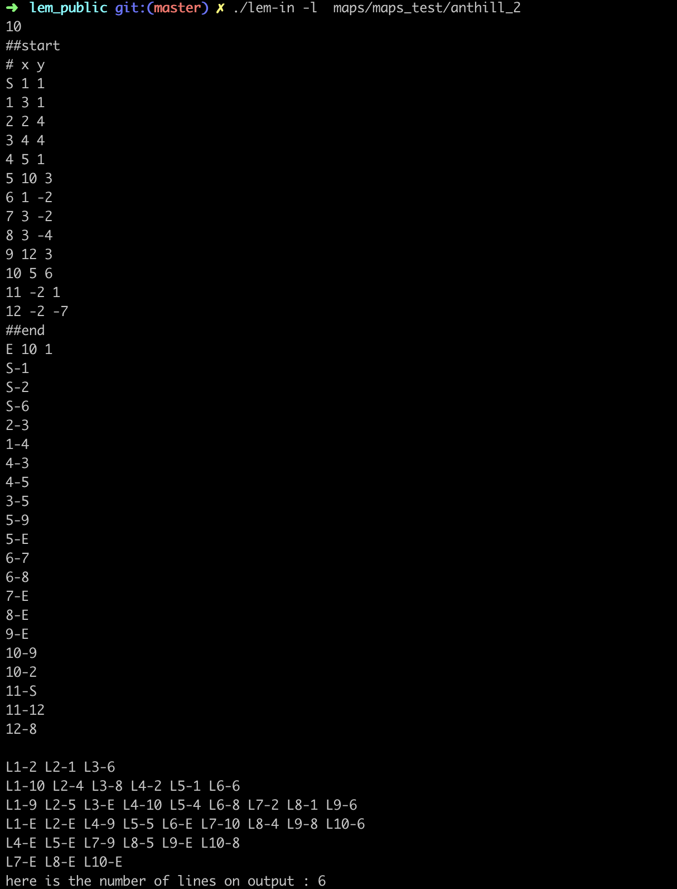
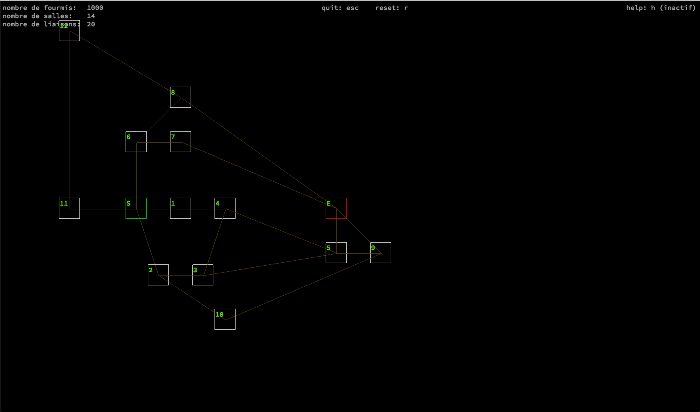

# lem-in

Path finding project

This code (my favorite so far) is a maze-solving program.
The purpose of the subject is to make ants go from start to end in the lowest number of turns possible. 
The first part of the code parses the input.

## The algorithm

The goal to achieve in this anthill is to find as much different paths as possible. Each independant path can support one ant column, where each turn 1 ant leaves start to move 1 room further on its path to end.
This implies finding a maximum number of possible path, sorting them into different compatible solutions, and dividing accurately the ants on the different multi-paths solutions to optimise the turn score. The best solutions of path combinaison is then selected, and the output part of the program prints the anthill and the movement of each ant threw the maze.

The program is structured as followed
1. parse input
2. store data
3. find a maximum of paths, divided in N families (where N = number of links of start). Each family of path has 64 possible childs (binary encoding on a 64 bits long integer)
4. Store paths
5. combine path families in path combinaisons possibilities
6. Check which combination is the fastest
7. print it

It looks like this :

This is what the maze looks like with the debug visualizer

### How to exec

You will need the following dependencies installed on your shell

GNU Make
GNU Compiler (gcc)
The MLX (for the visualizer, optionnal)

1. `make`
2. `./lem-in [map]` (`maps` folder )
3. optionnal -l for the number of lines of the solution -v for visual debug (only works for human-made maps, the coordinate system does not work for random genreated maps)

You can generate random maps with the `generator` script in the `maps` directory

Ex:

`./generator` gives you yhe usage of the script 
